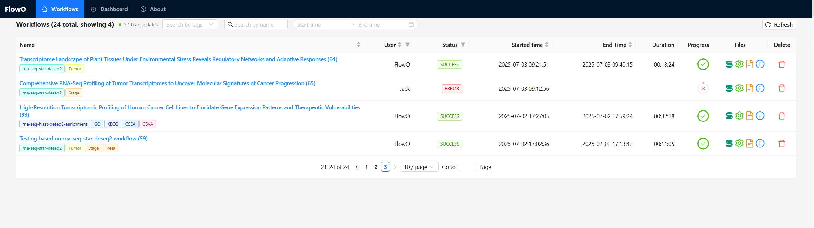
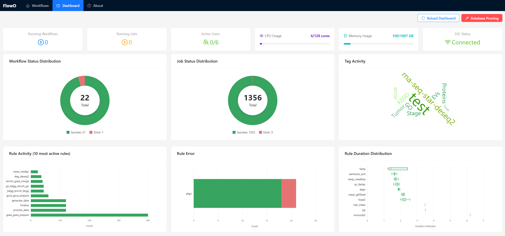
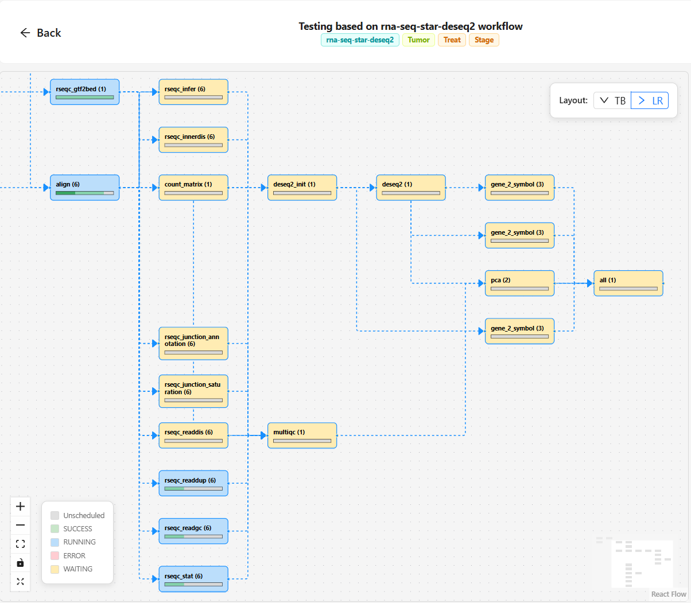
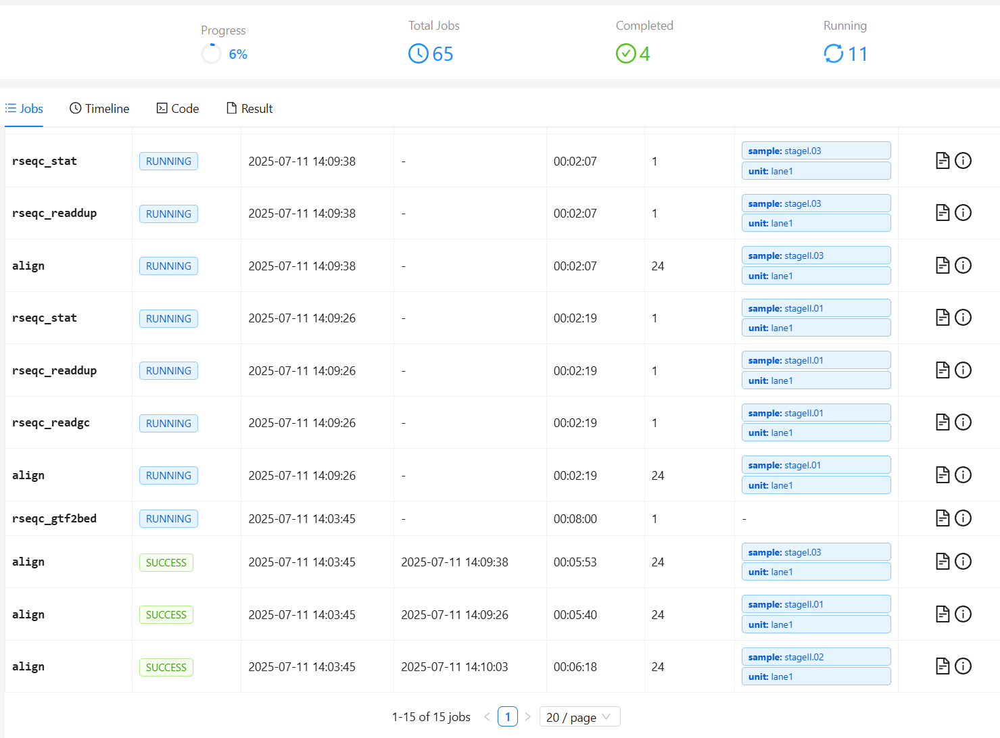

# Flowo 🚀

Welcome to **Flowo** – your modern, real-time workflow dashboard!

Unleash the power of automation and monitoring with a fresh, interactive experience.

---

## ✨ Features

- ⚡ **Real-time Monitoring:**
  Flowo uses Server-Sent Events (SSE) and PostgreSQL's LISTEN/NOTIFY mechanism for instant workflow updates. The frontend refreshes automatically – just sit back and watch the magic happen!

- 🚀 **Efficient Data Fetching:**
  With smart polling (every 5 seconds) and debouncing, Flowo keeps your data up-to-date without overloading the network. Fast, efficient, and always fresh.

- 🔍 **Search & Filtering:**
  Find what you need in a snap! Search and filter workflows by name, tags, or user. Delete workflows from the database with a click (no worries, your files are safe).

- 🧩 **Rule-based Filtering:**
  Focus on specific rules to filter jobs and update the execution timeline. Debug and optimize like a pro!

- 🖼️ **Result Preview:**
  Instantly preview output files generated by your favorite rules, right in the Results submenu. No more hunting for results!

- 📋 **Logging System:**
  Dive into detailed workflow and job logs. Analyze, learn, and improve your processes with ease.

---

### 🛠️ Workflows


### 📊 Dashboard


### 🕹️ Jobs
|  |  |
|------------------------------|-------------------------------|

---

## 🚦 Installation
- **Requirement:** Docker

### 1. Download
```sh
git clone https://github.com/zhanghaomiao/flowo.git && cd flowo
cp env.example .env
```

### 2. Installation Option 1 (Recommended)
This method pulls pre-built images, so you don't need to build them yourself. Note: The PORT is fixed at 3100 and cannot be changed. Set DOMAIN to your server's IP or domain.

Edit your `.env` file as follows:
```sh
# Application Settings
DOMAIN=localhost
PORT=3100
TZ=Asia/Shanghai

# Database Configuration
POSTGRES_DB=snakemake_logs
POSTGRES_USER=snakemake
POSTGRES_PASSWORD=snakemake_password
POSTGRES_HOST=localhost
POSTGRES_PORT=5432

# Workflow Directory
FLOWO_WORKING_PATH=/path/to/flowo_project_dir
```

To start Flowo:
```sh
docker compose -f docker-compose.release.yml up -d
```

Open http://localhost:3100 in your browser. If you changed DOMAIN, open http://yourdomain:3100 instead.

### 3. Installation Option 2 (Custom Build)
This method builds the images locally, allowing you to customize the PORT.

Edit your `.env` file as follows:
```sh
# Application Settings
DOMAIN=localhost
PORT=your_port
TZ=Asia/Shanghai

# Database Configuration
POSTGRES_DB=snakemake_logs
POSTGRES_USER=snakemake
POSTGRES_PASSWORD=snakemake_password
POSTGRES_HOST=localhost
POSTGRES_PORT=5432

# Workflow Directory
FLOWO_WORKING_PATH=/path/to/flowo_project_dir
```

To start Flowo:
```sh
docker compose -f docker-compose.yml up -d
```

Open http://localhost:your_port in your browser.


