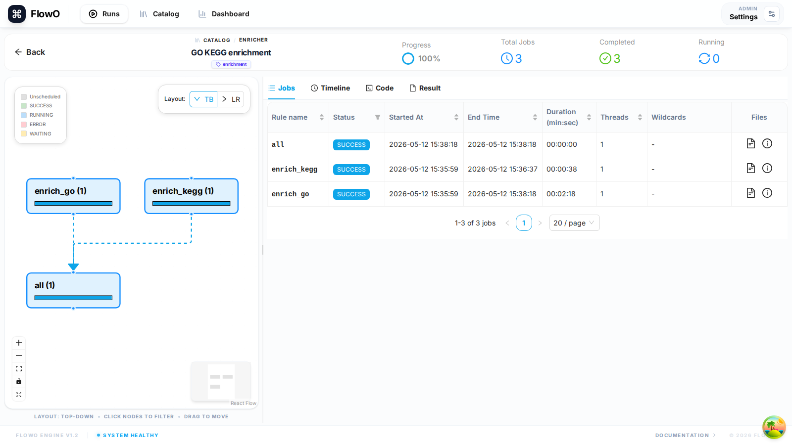
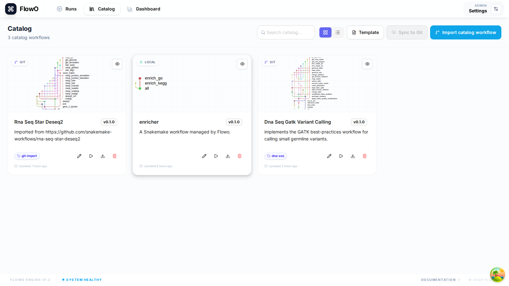
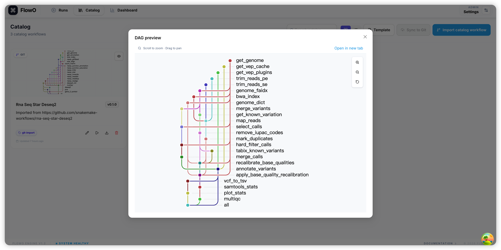

# FlowO

**FlowO** is a **Snakemake observability** and **workflow catalog** platform: run the official logger plugin alongside Snakemake, and the web app records every execution—live **Dashboard** and **Runs**, job-level logs and errors, optional **output preview**, and a **catalog** of versioned Snakemake projects you can browse, edit, and link back to runs.

**Full documentation:** [flowo-docs.pages.dev](https://flowo-docs.pages.dev/)

---
## Live demo

A hosted sandbox may be available at [flowo.iregene-bio.com](https://flowo.iregene-bio.com/). 
- Email: demo@demo.com
- Password: demo1234

For credentials or access policy, see the [Quick Start](https://flowo-docs.pages.dev/quickstart/) or contact the maintainers.

## Why FlowO

| | |
| --- | --- |
| **Real-time run monitoring** | PostgreSQL-backed history with **SSE** so the **Dashboard** and **Runs** views update as jobs start, finish, or fail. |
| **Deep visibility** | Per-run **DAG**, **Jobs**, **Timeline**, captured **code**, and **logs**—plus **result preview** when the server can read the same paths Snakemake used. |
| **Workflow catalog** | The **Catalog** stores Snakemake templates in the database (with versioning), materializes a workspace for Snakemake/DAG tooling, and ties runs to catalog entries when you report `catalog` metadata from the logger. |

---

## Quick start (~10 minutes)

### 1. Deploy with Docker Compose

From an empty directory (or use the same files from a `git clone` of this repo instead of `curl`):

```bash
curl -O https://raw.githubusercontent.com/zhanghaomiao/flowo/main/compose.yml
curl -O https://raw.githubusercontent.com/zhanghaomiao/flowo/main/env.example
cp env.example .env
```

Edit **`.env`**: set **`FLOWO_WORKING_PATH`** to a host path that contains (or is a parent of) your Snakemake project directories so logs and file previews resolve; set **`SECRET_KEY`** (and database passwords) for anything beyond a local trial.

Start the stack (PostgreSQL + FlowO image on port **3100** by default):

```bash
docker compose up -d
```

Wait until the `flowo` container is healthy, then continue.

More detail (HTTPS, `UID`/`GID`, paths, **all env vars**): **[Installation](https://flowo-docs.pages.dev/user-manual/installation/)**, **[Environment variables](https://flowo-docs.pages.dev/reference/environment-variables/)**, and **[Quick Start](https://flowo-docs.pages.dev/quickstart/)**.

### 2. Create an administrator (superuser)

Web self-registration creates a **normal** user. For **Settings**, user administration, invitations when public signup is off, and similar capabilities, you need at least one **superuser**. Pick **one** of these:

**A — Environment variables (best for people who only pull `compose.yml` / image):** in `.env` set both (example values are placeholders only):

```bash
FLOWO_BOOTSTRAP_ADMIN_EMAIL=you@example.com
FLOWO_BOOTSTRAP_ADMIN_PASSWORD='your-strong-password'
```

Then `docker compose up -d` as usual. On first start, after migrations, the container creates that superuser **only if the database has no superuser yet**. Remove or blank these variables after the first successful deploy; do not keep bootstrap passwords in `.env` long term. This path applies to the **published Docker image** whose entrypoint runs migrations and bootstrap (the default `compose.yml`). If you start the API from source without that entrypoint (for example `compose.dev.yml`), use option **B** or run `python -m app.manage bootstrap-admin-from-env` once with the same environment variables and database URL.

**B — One command after the stack is up:**

```bash
docker compose exec flowo python -m app.manage create-admin you@example.com 'your-strong-password'
```

Use a dedicated admin email; you can still register or invite other users later. If you already cloned the repo and run Compose from the project root, the service name remains **`flowo`**. For **`compose.dev.yml`**, run the same command against the API container: `docker compose -f compose.dev.yml exec flowo-backend python -m app.manage create-admin …`.

### 3. Sign in and use the CLI logger

1. Open [http://localhost:3100](http://localhost:3100) (or your `FLOWO_HOST`) and sign in with the superuser from step 2 (bootstrap env or `create-admin`). If **public registration** is enabled, you can instead register a first user in the UI—use a superuser anyway when you need admin features.
2. **Install the logger plugin** on the machine where Snakemake runs:

   ```bash
   pip install snakemake-logger-plugin-flowo
   ```

   Optional: `pip install "snakemake-logger-plugin-flowo[snakemake]"` if you need Snakemake in the same venv.

3. **Authenticate the CLI** (browser flow; token is written to `~/.config/flowo/config.toml`, mode `0600`):

   ```bash
   flowo login --host http://localhost:3100
   ```

   Replace the URL with your deployment (HTTPS in production).

4. **Run Snakemake** with the FlowO logger and open **Dashboard** / **Runs** in the browser:

   ```bash
   cd /path/to/your/workflow
   snakemake --logger flowo \
     --logger-flowo-name "my-run" \
     --logger-flowo-tags "demo,qc"
   ```

**Headless servers, CI, or MCP:** create a long-lived token under **Settings → API Tokens** and write **`~/.config/flowo/config.toml`** with `FLOWO_HOST`, `FLOWO_USER_TOKEN`, and `FLOWO_WORKING_PATH`. Avoid passing tokens on the command line because they can leak through shell history, process listings, scheduler logs, or CI logs. See **[Login and CLI setup](https://flowo-docs.pages.dev/user-manual/login-cli/)**.

---

## Screenshots

|  |  |
| --- | --- |
| **Dashboard** — fleet status and activity | **Run detail** — DAG, jobs, timeline, code, results |

|  |  |
| --- | --- |
| **Catalog** — browse stored workflows | **DAG preview** — best-effort rule graph (catalog / template) |

---

## Documentation map

| Section | What you will find |
| --- | --- |
| **[Quick Start](https://flowo-docs.pages.dev/quickstart/)** | Compose deploy, `create-admin`, `flowo login`, first Snakemake run. |
| **[Installation](https://flowo-docs.pages.dev/user-manual/installation/)** | Short Docker + `.env` checklist. |
| **[Environment variables](https://flowo-docs.pages.dev/reference/environment-variables/)** | Full tables for Compose / server settings. |
| **User manual** (same site) | Runs, catalog, DAG preview, results, jobs & errors. |
| **Architecture** | Data flow, catalog storage model. |
| **Advanced features** | **Optional** MCP and email (SMTP); not required for core use. |

---

## Contributing & development

```bash
git clone https://github.com/zhanghaomiao/flowo.git
cd flowo
docker compose -f compose.dev.yml up --build
```

- **Gateway:** `http://localhost:3100` (combined frontend + API in dev compose)
- **Backend API:** `http://localhost:8000`
- **Frontend (Vite):** `http://localhost:5173`

Build the docs locally:

```bash
uv sync --extra docs
uv run mkdocs build --strict
```

---


