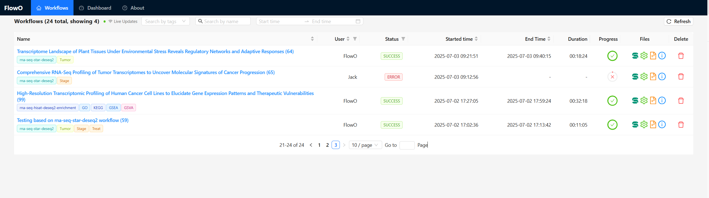
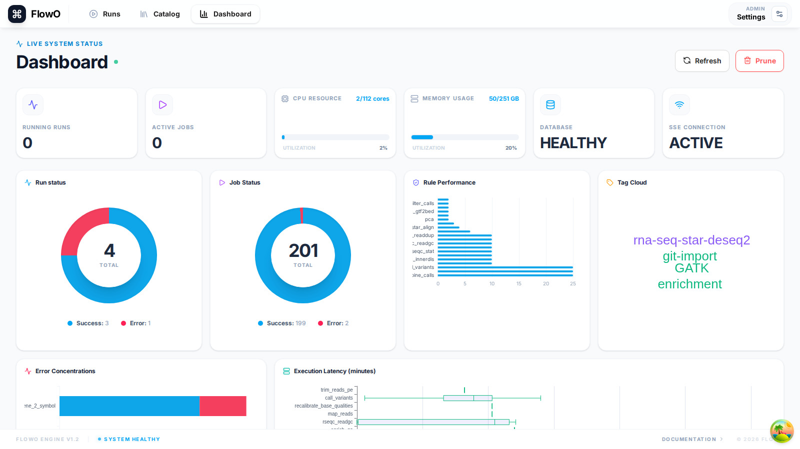
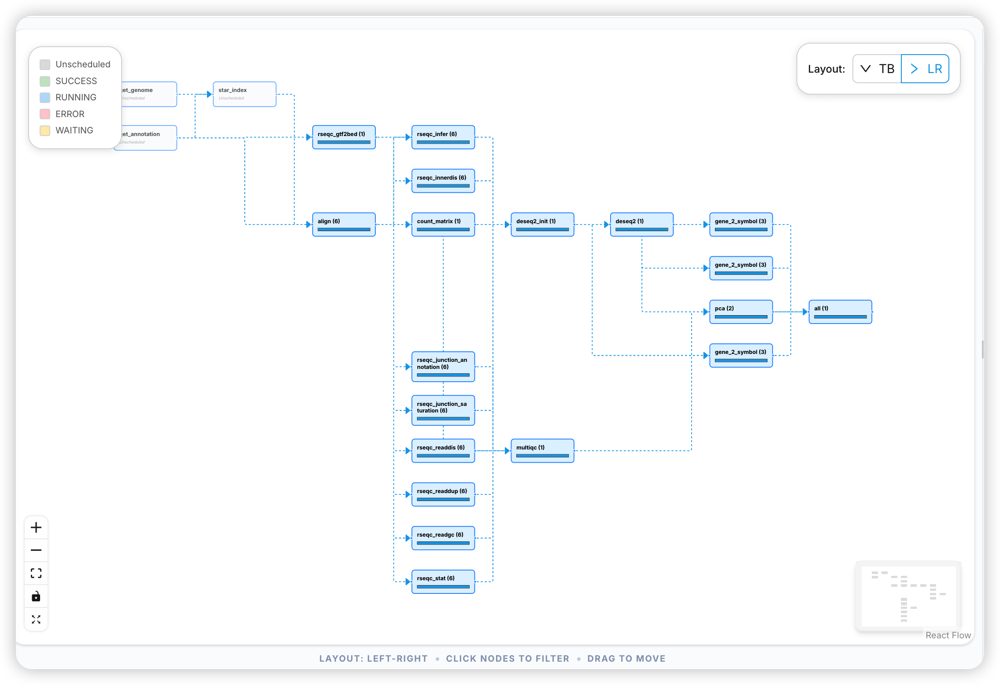
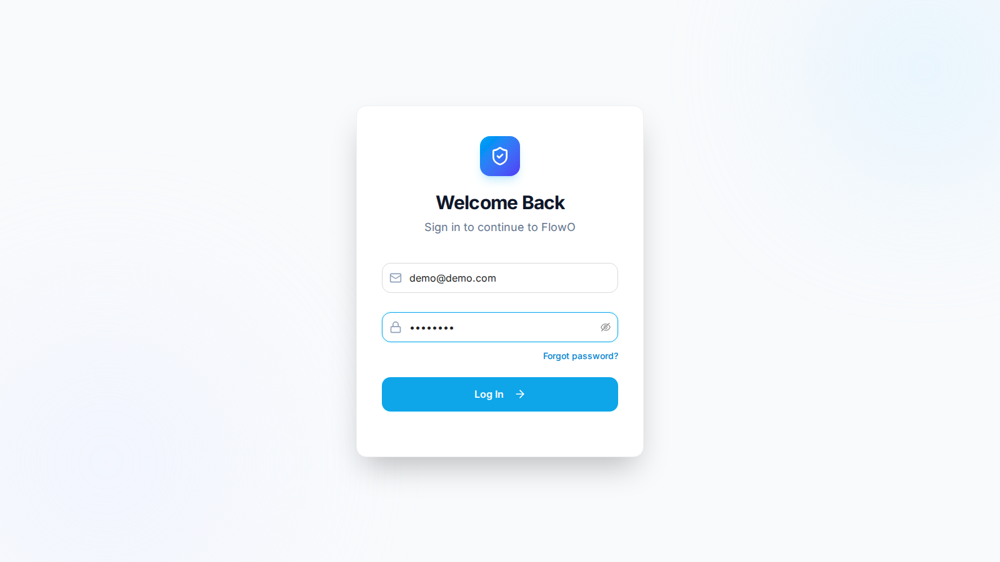
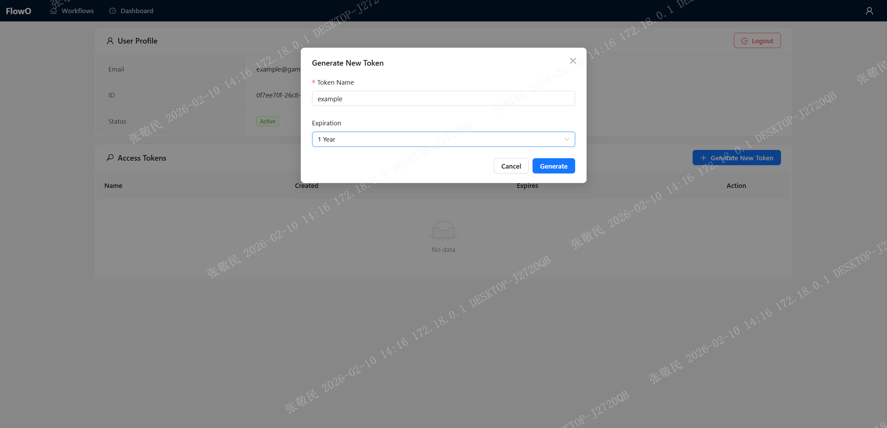
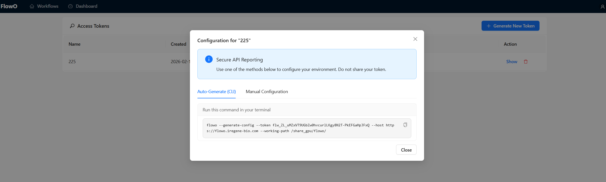

# Flowo 🚀

Welcome to **Flowo** – your real-time Snakemake workflow dashboard!

**Demo page: [flowo online](https://zhanghaomiao.github.io/flowo)**

**Documentation: [flowo docs](https://flowo-docs.pages.dev/)**

---

## ✨ Features

- ⚡ **Real-time Monitoring:** Instant workflow updates via SSE.
- 🔐 **Authentication:** Secure JWT-based registration and login.
- 🚀 **Efficient:** Smart polling and debouncing for low network overhead.
- 🔍 **Search & Filter:** Find workflows by name, tags, or user.
- 🧩 **Rule Focus:** Filter jobs and update execution timeline by rule.
- 🖼️ **Result Preview:** Preview output files directly in the browser.
- 📋 **Detailed Logs:** Access comprehensive workflow and job logs.

---

### 🛠️ Workflows



### 📊 Dashboard



### 🕹️ Jobs

|  |  |
| ---------------------------------- | ------------------------------------ |

---

## 🚦 Installation

### 1️⃣ Install the Snakemake Logger Plugin

```sh
pip install snakemake-logger-plugin-flowo
```

The PyPI package does not depend on Snakemake itself (it is expected in the environment where you run workflows). If you need Snakemake installed in the same environment—for example a minimal venv used only for the CLI—use:

```sh
pip install "snakemake-logger-plugin-flowo[snakemake]"
```

### 2️⃣ Install the Flowo web server (Single Image)

This method uses pre-built Docker images. For detailed instructions, please refer to the [Quick Start](https://flowo-docs.pages.dev/getting-started/) guide.

Clone the repo and start the service:

```sh
git clone https://github.com/zhanghaomiao/flowo.git
cd flowo
cp env.example .env
# Edit .env:
# - set SECRET_KEY to a long random value and keep it stable
# - set FLOWO_WORKING_PATH to a host directory for FlowO data
docker compose up -d
```


Open [http://localhost:3100](http://localhost:3100) to create your account.


Generate a token in your profile settings to configure the logger plugin.


Copy and run the CLI config snippet from the dashboard to finish setup.

---

## 🚀 Usage

```sh
cd /path/to/flowo_project_dir
mkdir demo                # Create a demo project folder
cd demo
wget https://raw.githubusercontent.com/zhanghaomiao/flowo/refs/heads/main/tests/demos/Snakefile
# Run snakemake with flowo logger
snakemake \
    --logger flowo \
    --logger-flowo-name=your_project_name \
    --logger-flowo-tags="tagA,tagB,tagC"
```

---

## 👩‍💻 Developer Guide

If you want to contribute or build from source:

```bash
docker compose -f compose.dev.yml up --build
```

- **Gateway**: `http://localhost:3100` (Accesses both Frontend and Backend)
- **Backend API**: `http://localhost:8000`
- **Frontend**: `http://localhost:5173`
