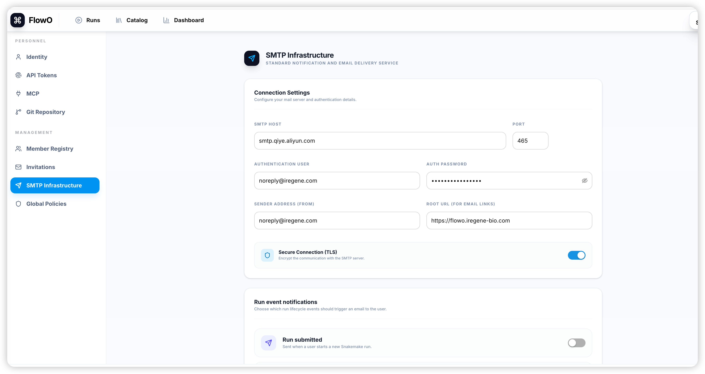

# Email notifications

!!! note
    **SMTP is optional.** FlowO works fully without outbound email; this page is for administrators who want lifecycle alerts.

FlowO can send email when runs start, succeed, or fail—**after** an administrator saves SMTP settings in the product.

## Where SMTP is configured

Configure outbound mail in the web UI:

1. Sign in as a user who can open **Settings** → **SMTP Infrastructure** (typically a **superuser**).
2. Enter host, port, credentials, and “From” identity, then save. Values are stored in **system settings** (database) and read by the notification service at send time.

There is **no** separate requirement to duplicate the same fields in a root `.env` for normal operation—use the **Settings** page as the source of truth.

### Typical fields (UI / API)

| Field | Role |
| --- | --- |
| SMTP host | Mail relay hostname (e.g. `smtp.gmail.com`). |
| SMTP port | Often `587` (STARTTLS) or `465` (implicit TLS). |
| SMTP user / password | Relay authentication when required. |
| From address / display name | Visible sender on notifications. |

## User preferences

After SMTP works at system level, each user may opt in under **user settings** (notification toggles) if your deployment exposes them.

### Common notification types

- **Workflow started**
- **Workflow succeeded**
- **Workflow failed** (often includes a deep link such as `/runs/{id}`)

## Sample notification

Failure emails usually include run name and id, triggering user, failed rule, and a link back to the run so reviewers can open logs immediately.

!!! note "Gmail and app passwords"
    If you use a personal Gmail account as the relay, you will likely need a Google **App Password** instead of your normal login password.
