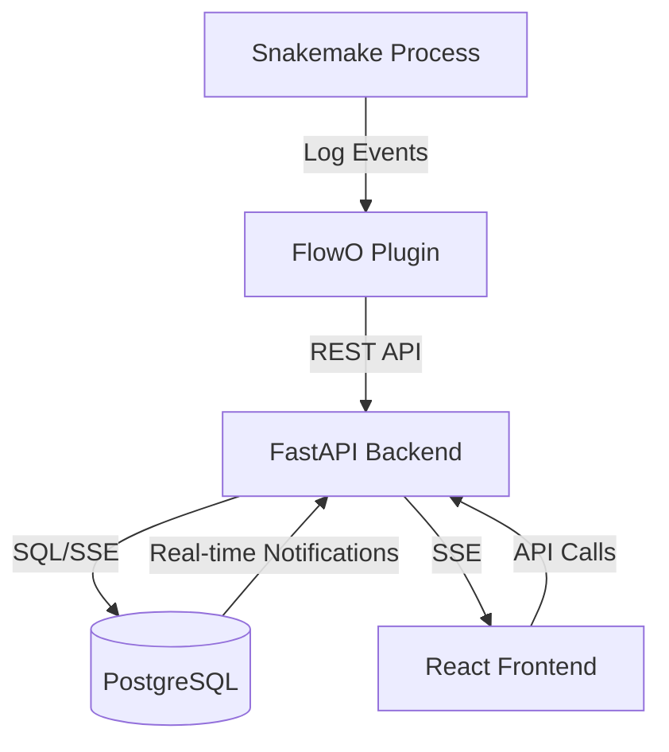

# Architecture

FlowO is a distributed system designed to handle large-scale workflow logging and monitoring. It follows a decoupled architecture separating data collection, storage, and visualization.

## Component Overview

### 1. Log Source (Snakemake & Plugin)

- **Snakemake Plugin**: Implements the Snakemake logging interface. It captures events during execution (Job execution, errors, logs) and batches them.
- **CLI Utility**: Included in the plugin package for managing local configuration and authentication tokens.

### 2. Backend (FastAPI)

- **REST API**: Handles ingestion of logs, job status updates, and workspace management.
- **PostgreSQL Listener**: Leverages PostgreSQL `NOTIFY/LISTEN` to detect changes in the database and push real-time updates to connected clients.
- **Authentication**: Secured with JWT and token-based access control (FastAPI Users).

### 3. Storage (PostgreSQL)

- Relational schema optimized for workflow metadata, job dependency graphs, and historical logs.
- Stores user accounts, access tokens, and project workspaces.

### 4. Frontend (React & Vite)

- **Dashboard**: A modern SPA built with Ant Design.
- **SSE Integration**: Uses Server-Sent Events to provide live updates of running workflows without page refreshes.
- **Workflow Visualization**: Interactive DAG visualization for tracking progress in real-time.

### 5. Infrastructure (Docker & Caddy)

- **Caddy**: A lightweight reverse proxy that orchestrates traffic between the Frontend and Backend, providing a unified entry point.
- **Docker Compose**: Simplifies the deployment of the entire stack in one command.

## Repository Structure

- `/app`: Backend FastAPI application.
- `/frontend`: React frontend application.
- `/docs`: Documentation source.
- `/docker`: Configuration for simplified deployment.
- `pyproject.toml`: Monorepo-style Python configuration managing both the backend and the plugin.
