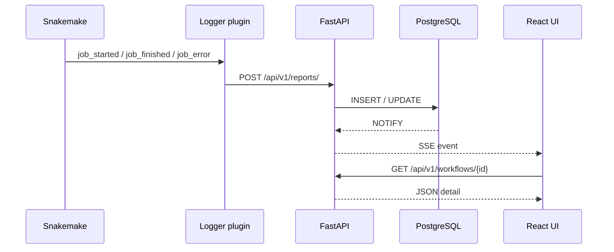

# Data flow

This page summarizes how a Snakemake run becomes rows in PostgreSQL and how the browser stays fresh—enough for operators and paper readers without diving into Python modules.

## Ingestion (plugin → API → database)

1. **Snakemake** loads `snakemake-logger-plugin-flowo` when you pass **`--logger flowo`**.
2. The plugin turns Snakemake callbacks into **JSON payloads** (shared Pydantic schemas in `flowo_common`) and **POST**s them to **`/api/v1/reports/`**.
3. The FastAPI layer validates each report and **UPSERTs** into relational tables (`workflows`, `jobs`, `rules`, `errors`, …).

Typical high-level event types include:

| Event (conceptual) | Purpose |
|--------------------|---------|
| Workflow start / finish | Create or close the run row; capture tags, name, catalog slug, working directory. |
| **Rule graph** | Persist DAG structure for visualization. |
| **Job started / finished** | Drive progress, timeline, and per-job metadata. |
| **Job error** | Attach stderr, traceback pointers, and failure status. |

Exact enum names in payloads align with the plugin version bundled in your deployment.

## Real-time path (database → SSE → UI)

1. After relevant writes, PostgreSQL **`NOTIFY`** carries a compact payload on a channel the backend subscribes to (`LISTEN`).
2. The backend **`pg_listener`** forwards notifications to active **Server-Sent Event** connections scoped per user/run.
3. The React app invalidates **React Query** caches or patches local state so **Dashboard** and **Runs** refresh without manual reload.

## File reads (logs and previews)

When you open a log or preview:

1. The UI calls **`/api/v1/files/`** or **`/api/v1/outputs/`** (and related endpoints) with an id the user is allowed to see.
2. The service loads the **relative path** stored at ingest time and joins it with **`FLOWO_WORKING_PATH`** (container mount) on the server.
3. Bytes stream back with an appropriate MIME type; size limits may apply for browser preview.

## See also

- [Architecture overview](overview.md)
- [Catalog storage model](catalog-storage.md)
