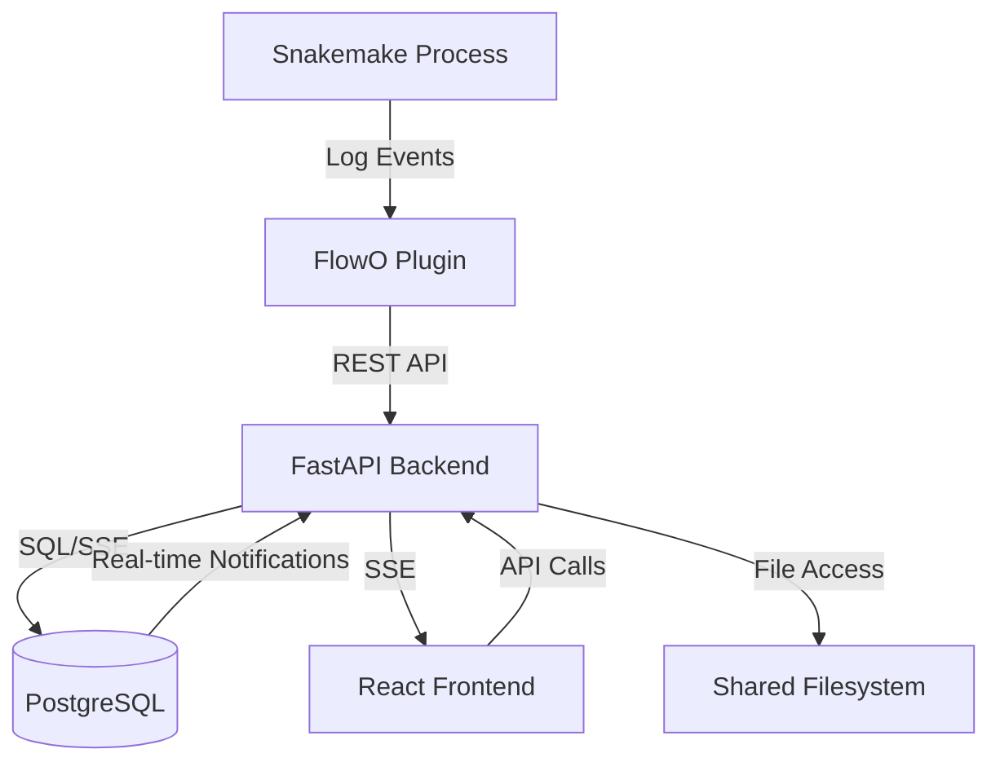

# Architecture Overview

FlowO is designed for scalability and real-time responsiveness. It separates the concerns of data collection, persistent storage, and interactive visualization.

## Component Diagram

## Key Components

### 1. Snakemake Logger Plugin
A Python package that implements the Snakemake logging interface. It runs alongside your workflow, capturing events such as:
- Workflow start/stop
- Job start/finish/error
- Rule graph (DAG) structure
- Log file paths and console output

### 2. FastAPI Backend
The core service that orchestrates data flow:
- **Ingestion**: Receives and validates events from the plugin.
- **API**: Serves data to the frontend for dashboard rendering.
- **SSE Handler**: Manages real-time event streams using PostgreSQL `LISTEN/NOTIFY`.
- **Auth**: Manages user authentication and API tokens.

### 3. PostgreSQL Database
The source of truth for all workflow data. It uses a relational schema to store complex job dependencies and historical runs. It also acts as a message broker for real-time updates.

### 4. React Frontend
A modern, responsive Single Page Application (SPA) that provides:
- Live monitoring dashboards.
- Interactive DAG and timeline visualizations.
- File browsing and result previews.

### 5. Shared Filesystem (Optional)
While not a service, a shared filesystem (or matching paths between the execution node and the FlowO server) is required for full functionality like log viewing and result previews.
