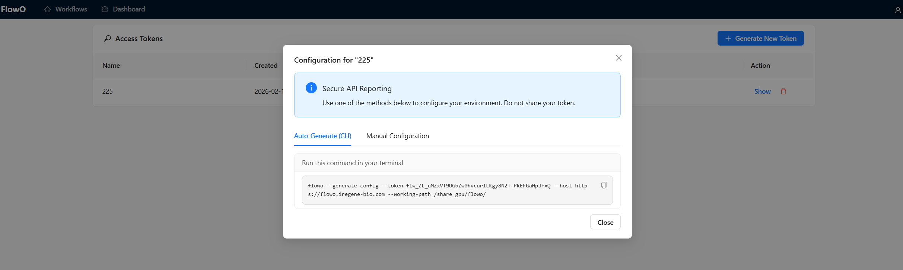

# Getting Started with FlowO

Welcome to FlowO! This guide provides detailed instructions on setting up the environment and using FlowO with your workflows.

## Deployment

FlowO consists of several services orchestrated via Docker Compose.

<!-- prettier-ignore -->
!!! tip "Deployment Location"
    You can deploy FlowO anywhere. Just keep in mind that if it's not on the same machine as your workflow data (`FLOWO_WORKING_PATH`), file browsing features (logs, previews) will be disabled, but status monitoring will still work.

### 1. Prerequisites

- Docker and Docker Compose installed.
- Python 3.12+ (for the CLI/Plugin).

### 2. Setup environment

Copy the `env.example` to `.env`. In most cases, you only need to modify `FLOWO_WORKING_PATH` to point to the directory where you run your Snakemake workflows.

```bash
cp env.example .env
```

### 3. Start Services (Recommended)

Start the Flowo web service using our pre-built images. This is the fastest way to get started and requires no local build.

```bash
docker compose -f docker/compose.yml up -d
```

Alternatively, if you want to build from source (e.g., for development), run:

```bash
docker compose up -d
```


Open [http://localhost:3100](http://localhost:3100) in your browser. Create your account and log in. If you see the Flowo interface and the "Live Updates" icon is green, congratulations—your Flowo web service is running successfully!

This will spin up:

- **PostgreSQL**: Stores all workflow data.
- **Backend (FastAPI)**: The core API service.
- **Frontend (React)**: The monitoring dashboard.
- **Caddy**: Reverse proxy handling unified access to the stack.

## Client-side Installation

To use FlowO with Snakemake, you need to install the plugin on your local machine or compute cluster.

### 1. Install via Pip

```bash
pip install snakemake-logger-plugin-flowo
```

### 2. Generate an Access Token


Next, create a token, which is required to configure the snakemake-logger-plugin-flowo. Click the user icon in the top-right corner, select Generate New Token, then provide a name and set an expiration time. Once confirmed, the token will be generated successfully.

### 3. Configure the CLI


After that, click Config to access a CLI snippet. Copy and run this command in the terminal where snakemake-logger-plugin-flowo is installed. Once it finishes executing, the setup will be complete.

## Usage with Snakemake

Once configured, you can trigger Flowo logging in any Snakemake workflow.

Let's test with a demo project:

```bash
cd /path/to/flowo_project_dir
mkdir demo                # Create a demo project folder
cd demo
wget https://raw.githubusercontent.com/zhanghaomiao/flowo/refs/heads/main/tests/demos/Snakefile
# Run snakemake with flowo logger
snakemake \
    --logger flowo \
    --logger-flowo-name=your_project_name \
    --logger-flowo-tags="tagA,tagB,tagC"
```

### Advanced Usage

You can customize how your workflow appears in Flowo using additional logger arguments:

- `--logger-flowo-name`: Set a custom display name (title) for the workflow.
- `--logger-flowo-tags`: Add comma-separated tags to help with filtering and organization.

Flowo will track your workflow progress and job statuses in real-time based on these settings.
