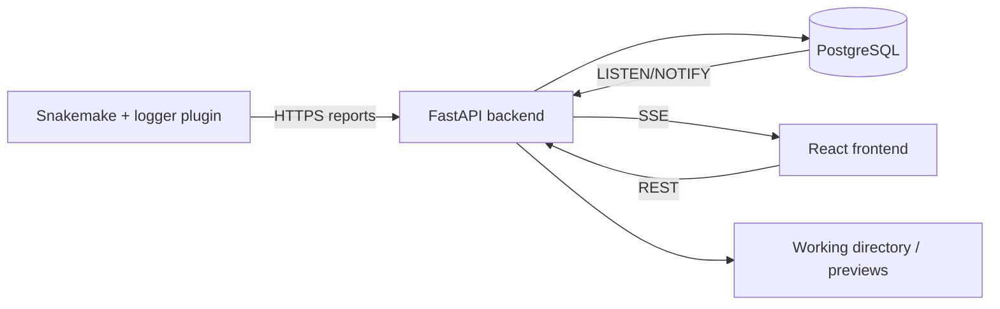

# Welcome to FlowO

**FlowO** is an open-source monitoring and management platform for **Snakemake**. It connects terminal-based workflow execution to a live web UI: every run is recorded, searchable, and diagnosable from the browser.


## What is FlowO?

FlowO pairs a **Snakemake logger plugin** with a **FastAPI + PostgreSQL** backend and a **React** frontend. While Snakemake runs, events are pushed over HTTP; the database holds the canonical history; **Server-Sent Events (SSE)** keep the UI up to date without polling.

## Who should use FlowO?

- **Bioinformaticians and data scientists** running Snakemake in HPC, cloud, or workstations who want a shared view of runs.
- **Lab or platform teams** that need job-level logs, errors, and output previews in one place.
- **Groups standardizing pipelines** via an internal **Catalog** of Snakemake templates (and optional official template sync).

## Core value

| Capability | What you get |
|-------------|----------------|
| **Real-time monitoring** | Live progress, job states, and dashboard aggregates as the logger reports events. |
| **Workflow and job diagnosis** | Rule names, wildcards, shell commands, logs, and tracebacks for failed jobs. |
| **Output preview** | In-browser preview for common text, table, HTML, and image outputs when paths are visible to the server. |
| **Catalog / template reuse** | Browse, version, and link runs to catalog workflows; pull or upload templates. |
| **Optional MCP** | Connect an MCP-aware assistant to summarize runs, search catalog files, or trace outputs—**not required** for day-to-day use. |

## High-level architecture



## Try FlowO in three steps

1. **Run the stack** (or use a hosted demo—see [Quick Start](quickstart.md)):

   ```bash
   docker compose up -d
   ```

2. **Authenticate the CLI** (browser-based login; no manual token copy when using defaults):

   ```bash
   flowo login --host https://your-flowo-host
   ```

3. **Run Snakemake with the logger**:

   ```bash
   snakemake --logger flowo --logger-flowo-name my-experiment --logger-flowo-tags demo,qc
   ```

Open the **Runs** tab (`/runs`) and the **Dashboard** to see the new run appear in real time.

[Quick Start](quickstart.md){ .md-button .md-button--primary }

[User manual overview](user-manual/overview.md){ .md-button }
