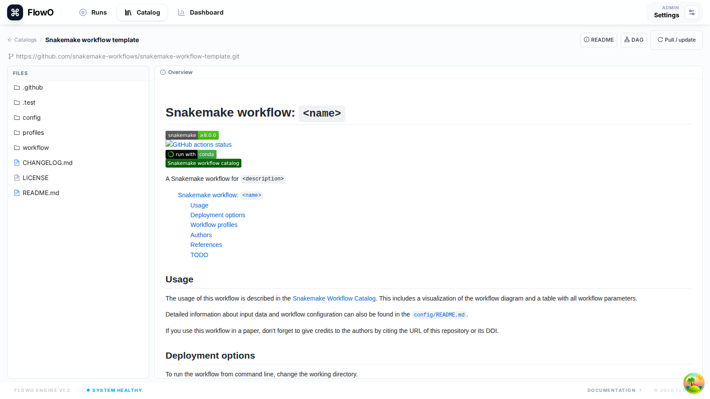

# Catalog and templates

In FlowO, the **Catalog** is the product area where you manage **Snakemake workflow projects** that live in the database. Concretely:

- The **`catalogs`** table stores **one row per catalog entry**—that is, **one Snakemake workflow / template** you imported, uploaded, or synced (not “the whole catalog product” as a single row).
- **File contents** (Snakefile, `config/`, `workflow/rules/`, …) are stored in PostgreSQL (`catalog_files` / `catalog_file_versions`). The database is the **source of truth** for what you see and edit in the UI.
- A **materialized workspace** on disk under **`FLOWO_WORKING_PATH`** exists so Snakemake, Snakevision, exports, and similar tools can run against real paths. If that directory is empty or out of date, FlowO can **re-materialize** from the database—it does **not** mean your catalog data was lost.

## Browsing the catalog

The Catalog page lists every entry. Each row includes:

- **Name and description** — what the workflow is for.
- **Tags** — e.g. RNA-Seq, QC, project labels.
- **DAG column** — thumbnail or state for best-effort DAG generation.
- **Last updated** — when files or metadata last changed.

## Catalog entry detail

Open an entry to inspect the stored project:

- **File tree** — browse `Snakefile`, `config/`, `workflow/rules/`, etc.; content is served from the **database** (the UI does not require a populated disk cache to read text).
- **Source / editor** — view or edit file text; saves create new **versions** in the database.
- **Runs** — executions that reported this catalog (when the logger sent catalog metadata).
- **DAG preview** — optional Snakevision / `snakemake` pipeline (see [DAG preview](dag-preview.md)).

## Using a catalog entry

1. **Pull / download** — use the UI or CLI (`flowo catalog pull …`) to copy the workflow to a machine where you will run Snakemake.
2. **Run Snakemake** with **`--logger flowo`** and, when applicable, **`--logger-flowo-catalog <slug>`** so the run is linked to this catalog entry.

## Managing the catalog

- **New entry** — upload a ZIP or connect a Git remote (per your deployment’s features).
- **Versioning** — each save writes a new row in **`catalog_file_versions`** so you can audit changes.
- **Disk cache** — FlowO **maintains** a local checkout under the configured working path for Snakemake compatibility and DAG generation; treat it as a **derived** copy of the database, not the authoritative store.
