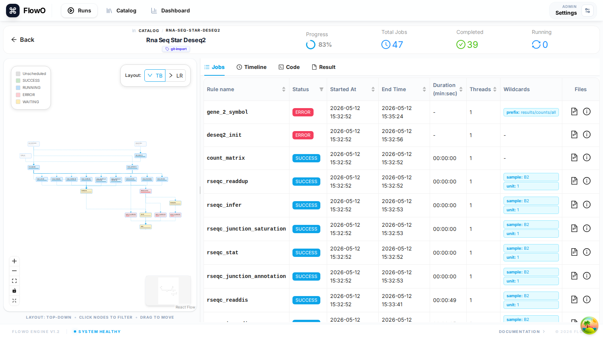

# Jobs, logs, and errors

FlowO is built around **job-level** observability: every Snakemake job row is tied to status, wildcards, commands, and—when failures occur—structured error payloads and log paths.

## Jobs table (run detail → Jobs)

Open a run at **`/runs/{id}`**, select the **Jobs** tab, and sort or scroll by rule and status. Columns typically include rule name, status, runtime, and wildcard key material so you can spot mis-parameterized rules quickly.

## From a failed job to the root cause

1. **Status** — `FAILED` jobs surface in the table and in dashboard aggregates.
2. **Error summary** — Open the job row or the workflow-level error list; FlowO stores Snakemake’s error message and traceback when provided by the logger.
3. **Shell command** — Inspect the resolved command (wildcards expanded) to compare with what you intended to run.
4. **Logs** — Open the job log path captured at runtime, or use workflow-level log modals from the Runs list when enabled.

## Common statuses

| Status | Meaning |
|--------|---------|
| Queued / pending | Waiting on dependencies or scheduler. |
| Running | Currently executing. |
| Success / completed | Finished without Snakemake error. |
| Failed | Snakemake reported `job_error` or non-zero exit where captured. |
| Cancelled | Run stopped before the job finished. |

Exact strings may match your Snakemake version and normalisation in FlowO; use the UI labels as the source of truth.

## Troubleshooting tips

- **Wildcards** — Wrong expansion is a frequent source of “file not found” or empty inputs; compare table wildcards with `Snakefile` placeholders.
- **Repeated rule failures** — Use the **Dashboard** “rule errors” style summaries to see hotspots across runs.
- **“Command not found”** — Verify conda/env modules on the **execution host**; FlowO shows what was reported, not your interactive shell `PATH`.

## See also

- [Run detail layout](workflow-detail.md)
- [FAQ — previews and DAG issues](../faq.md)
