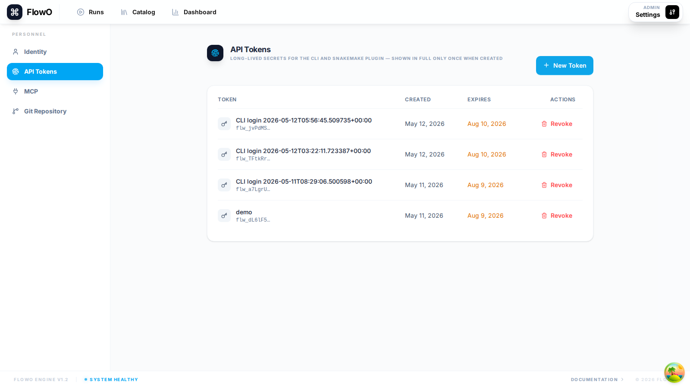

# Login and CLI setup

Authenticating your workstation lets the Snakemake logger post events **without pasting long API tokens** into the shell when you use the supported browser flow.

!!! tip
    If you are evaluating a **shared demo deployment**, get the URL and any demo credentials from your **maintainers** or administrator. Do not store sensitive data on shared hosts.

## Recommended: `flowo login` (default path)

1. Install the PyPI package (see [Installation](installation.md)) so the `flowo` CLI is available.
2. Run (replace the host with your deployment):

   ```bash
   flowo login --host https://your-flowo-host
   ```

   Optional: **`--working-path /path/on/this/machine`** if that path differs from the value the server would suggest (see below).

3. A browser window opens (or prints a URL). Sign in to FlowO and approve the device.
4. On success, the CLI writes **`~/.config/flowo/config.toml`** (Linux/macOS; similar paths on Windows) with `0600` permissions, including **`FLOWO_WORKING_PATH`** when the server returns it in the login response (typical Docker: same path you set in the server `.env`).

Example session (wording may vary slightly by CLI version; tokens are **not** echoed):

```text
$ flowo login --host https://your-flowo-host
Opening browser for authentication…
Waiting for you to approve this device in the browser…
Login successful. Configuration saved to ~/.config/flowo/config.toml
```

The file should look like this (use your real host and paths; keep the token private):

```toml
FLOWO_HOST = "https://your-flowo-host"
FLOWO_USER_TOKEN = "<stored-by-flowo-login>"
FLOWO_WORKING_PATH = "/same/host/path/as/the/server/FLOWO_WORKING_PATH"
```

For **`flowo login`**, the server includes **`FLOWO_WORKING_PATH`** in the device-login response so the CLI can persist it automatically when you do **not** pass **`--working-path`**. That keeps same-host Docker setups aligned with the Compose mount. Override with **`--working-path`** when your Snakemake host sees a different absolute path than the server’s configured value.

## Fallback: API tokens (headless, CI, or MCP)

Use this path **only** when you cannot open a browser on the execution node (batch clusters, locked-down CI, or some MCP setups). Day-to-day use should stay on **`flowo login`** above.

1. In the web UI: **Settings** → **API Tokens** → create a token with a label and expiry.
2. Configure the CLI manually (or use the copy-paste command FlowO shows), for example:

   ```toml
   host = "https://your-flowo-host"
   token = "your-secret-api-token"
   ```



!!! note
    Treat tokens like passwords. Prefer **`flowo login`** when possible so tokens are not echoed in shell history.

## Verify connectivity

```bash
flowo catalog list
```

An empty list without an error means authentication and HTTPS reachability are working.

## See also

- [Run Snakemake with FlowO](run-snakemake.md)
- [FAQ — token storage and login failures](../faq.md)
