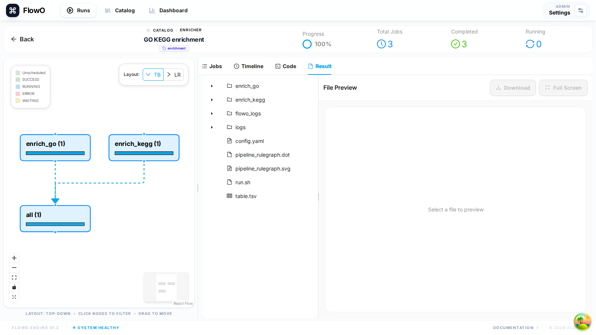

# Results Preview

FlowO allows you to browse and preview your workflow outputs directly from the web interface, reducing the need to manually download or transfer files.

## Browsing results

In the run detail page (`/runs/{id}`), open the **Result** tab to browse outputs reported for that execution.

## Supported Preview Formats

FlowO includes built-in viewers for common bioinformatics and data science file types:

- **Images**: PNG, JPG, SVG (ideal for plots and QC charts).
- **Tabular Data**: TSV, CSV (rendered as interactive, sortable tables).
- **Text/Code**: Snakefiles, shell scripts, logs, and generic text files.
- **Web Reports**: HTML files (e.g., FastQC reports, MultiQC summaries) are rendered in a safe sandbox.

## How it Works

For file previews to function:
1.  **Correct Working Path**: The `FLOWO_WORKING_PATH` in your `.env` must point to the root directory where your Snakemake project runs.
2.  **File Existence**: The files must still exist on the server's disk.
3.  **Permissions**: The FlowO backend user must have read permissions for the output files.

## Downloading Files

Any listed file can be downloaded from the Result tab when the download action is shown.

!!! tip
    You can also open outputs from the **Jobs** tab when a job row exposes linked output paths.
