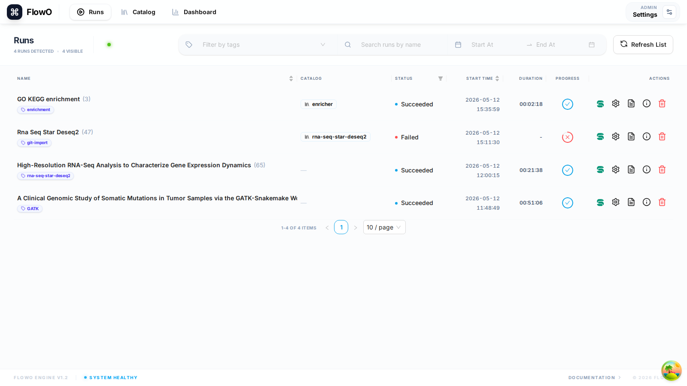

# Run Snakemake with FlowO

Integrating FlowO into your existing Snakemake execution is as simple as adding a single flag.

## The `--logger` Flag

To enable FlowO reporting, append the `--logger flowo` argument to your Snakemake command:

```bash
snakemake --logger flowo
```

## Customizing the Run

You can provide additional metadata to help organize your runs in the dashboard using logger-specific arguments.

### Set a Custom Name
By default, FlowO uses the project directory name. Use `--logger-flowo-name` to set a more descriptive title.

```bash
snakemake --logger flowo --logger-flowo-name "RNA-Seq Sample Analysis"
```

### Add Tags
Use comma-separated tags with `--logger-flowo-tags` to categorize your runs (e.g., project IDs, sample types, or experimental conditions).

```bash
snakemake --logger flowo --logger-flowo-tags "project-x,rna-seq,control"
```

### Associate with a Catalog Entry
If you are running a workflow derived from the FlowO Catalog, specify the slug using `--logger-flowo-catalog`.

```bash
snakemake --logger flowo --logger-flowo-catalog "rna-seq-pipeline"
```

## Configuration via Snakefile/Config

Instead of long command-line arguments, you can define FlowO settings directly in your Snakemake configuration.

### In `config.yaml`:
```yaml
flowo_project_name: "My Custom Project"
flowo_tags: "experiment-1,debug"
```

### In a Python dict inside the Snakefile:
```python
config["flowo_project_name"] = "My Custom Project"
config["flowo_tags"] = "experiment-1,debug"
```

## Verification

When the logger is active, switch to **Runs** (`/runs`) in the browser: the new row should appear within a second or two while jobs stream in over SSE.


